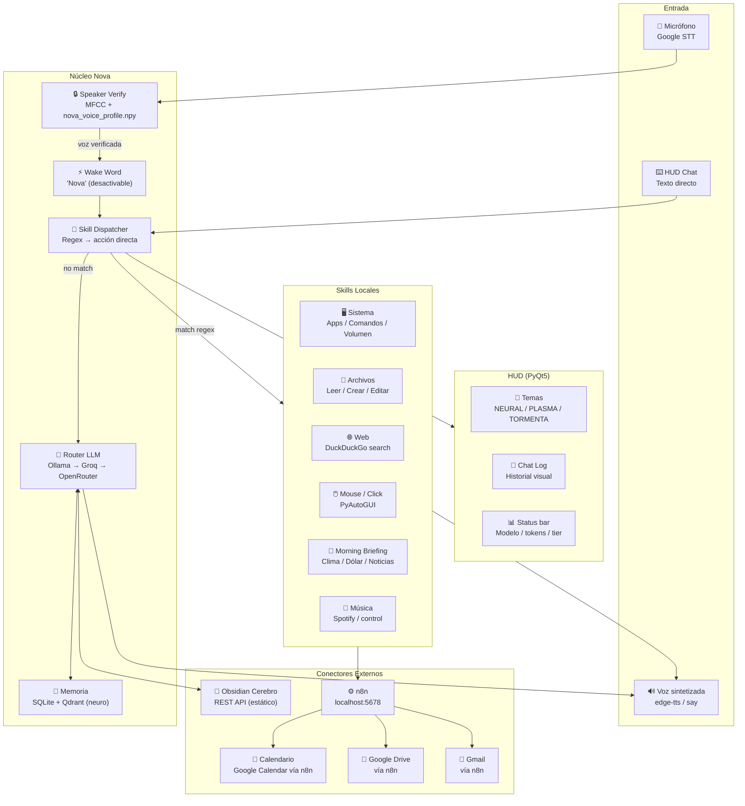
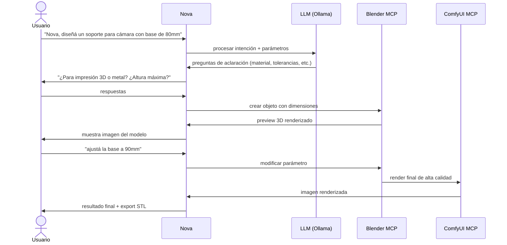
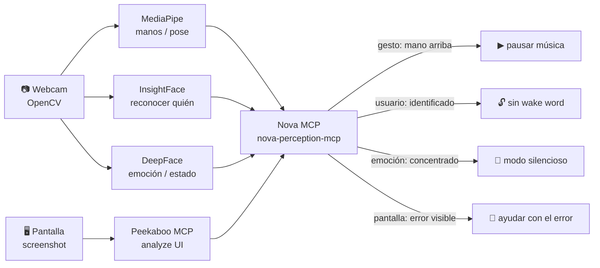

# NOVA — Roadmap Técnico v3.4
> Última actualización: 2026-05-06  
> Sesiones: auditoría de bugs + MCPs + speaker verification + Blender 3D + REPL completo + HUD redimensionable + Cerebro dinámico + Orquestador paralelo + **Red/BT/Pronóstico + LLM Dispatcher + mem0 Groq + mejoras imagen + OpenRouter curado + auditoría de Markdown**

---

## 0. Auditoría 2026-05-06 — Pendientes y Deuda Detectada

### Hallazgos principales

| Prioridad | Hallazgo | Impacto | Acción |
|---|---|---|---|
| P0 | Suite base de tests reproducible | Resuelto para smoke base; faltan mas casos sin efectos laterales | Usar `python3.10 -m pytest -q`; mantener integraciones externas gated por `NOVA_RUN_*` |
| P0 | Telegram Receive sigue pendiente | Nova puede enviar Telegram pero no cerrar loop conversacional remoto | Crear workflow n8n con Telegram Trigger y prueba end-to-end |
| P1 | Documentación desincronizada | README/ROADMAP/WORKFLOW tenían estados y rutas contradictorias | Mantener `STATUS.md` como estado real, `WORKFLOW.md` como tablero, ROADMAP como dirección |
| P1 | Memoria tiene narrativas mezcladas | Mem0 + Qdrant, SQLite, Cerebro file-based y RAG Obsidian aparecen como si todos fueran el camino principal | Consolidar arquitectura oficial y deprecar o reparar `nova_rag_obsidian.py` |
| P1 | Perception MCP está activo en desarrollo pero no figura como fase cerrada | Riesgo de asumir integración completa sin smoke test end-to-end | Agregar prueba MCP initialize/list/call y documentar tools disponibles |
| P2 | OCR/UI recognition está mencionado como futuro en docs enhanced | Limita acciones sobre pantalla y automatización visual | Implementar OCR opcional con fallback claro |
| P2 | Plugins/skills externas aparecen como objetivo pero sin contrato mínimo | Puede crecer desordenado | Definir formato de skill, metadata, instalación y pruebas |

### Regla de documentación desde esta auditoría

- `STATUS.md` describe solo lo verificado.
- `WORKFLOW.md` contiene la cola activa y criterios de cierre.
- `NOVA_ROADMAP.md` contiene fases, visión y backlog técnico.
- Los documentos en `docs/` deben indicar si son guía vigente, legacy o propuesta.

---

## 1. Estado Actual del Sistema

### Arquitectura operativa



### Componentes — estado real

| Componente | Estado | Observaciones |
|---|---|---|
| STT Google | ✅ Operativo | `phrase_time_limit=12s` |
| Speaker Verification | ✅ Integrado | MFCC + `nova_voice_profile.npy` — re-enroll realizado y verificado por el usuario |
| Wake word "Nova" | ✅ / Desactivable | Auto-desactiva si hay perfil de voz |
| Router LLM | ✅ Operativo | Ollama → Groq → OpenRouter fallback |
| Skills dispatch | ✅ Operativo | Regex + 30+ skills locales |
| Morning briefing | ✅ Por voz/texto | Clima real + dólar + noticias |
| HUD PyQt5 | ✅ Operativo | Temas NEURAL/PLASMA/TORMENTA |
| edge-tts | ✅ Operativo | Fallback a `say` macOS |
| n8n workflows | ✅ 11 workflows | Drive, Calendario, Email ×3, Gastos, Telegram |
| Obsidian/Cerebro | ✅ Operativo | `nova_cerebro.py` busca file-based en `~/Cerebro/` y usa REST API si Obsidian corre |
| RAG vectorial Obsidian | ⚠️ A decidir | `nova_rag_obsidian.py` conserva TODO de persistencia; definir deprecación o reparación |
| model_stats.json | ✅ Operativo | Se genera y HUD muestra métricas resumidas por evento |
| Blender MCP | ✅ Operativo | TCP socket → BlenderMCP addon → Blender 4.5 |
| REPL CLI | ✅ Mejorado | Banner ASCII, git branch, repo awareness, contexto CWD |

---

## 2. Bugs Corregidos — Sesión 2026-05-02/03

| # | Bug | Fix aplicado |
|---|---|---|
| 1 | TTS decía "asterisco", "guion", "corchete" | `_clean_for_speech()` — limpia markdown antes del TTS |
| 2 | Skills no quedaban en history → LLM sin contexto | `_on_text_input` ahora agrega user+skill a `history[]` |
| 3 | Texto HUD sin system prompt → LLM sin lista de capacidades | `_on_text_input` usa `_build_messages()` igual que voz |
| 4 | Groq 400 "discriminator" en historial largo | `_build_messages` filtra roles `system` del history |
| 5 | Mensaje de usuario aparecía dos veces en chat | Eliminado `user_text` del `put_state()` en text input |
| 6 | "dime el dia de hoy" no disparaba skill | Regex de fecha expandido |
| 7 | "maus" no reconocido como mouse | Variante agregada al regex de PyAutoGUI |
| 8 | "morning briefing" caía al LLM | Dispatch directo a `morning_digest()` |
| 9 | Speaker verify integrada pero perfil en ruta incorrecta | Path multi-candidato: raíz→tools→__DOTNOVA_PATH__ |
| 10 | Enrollment 20s sin guía → perfil de baja calidad | 3 rondas de 30s con frases guiadas + promedio vectores |

---

## 2b. Implementaciones — Sesión 2026-05-04

### Blender 3D Integration
| # | Implementado | Detalle |
|---|---|---|
| 1 | `nova_blender.py` — conector TCP al BlenderMCP addon | Protocolo `{"type":"execute_code","params":{"code":...}}` |
| 2 | Skill `skill_blender_crear` | Genera script Blender con LLM + ejecuta en Blender |
| 3 | Skill `skill_blender_ejecutar` | Ejecuta código Python arbitrario en Blender |
| 4 | Skill `skill_blender_aprobar` | Aprueba último script como ejemplo de referencia |
| 5 | Sistema few-shot `blender_examples/` | Indexado por tags, inyectado como few-shot en Groq |
| 6 | Ejemplos aprobados | `engranaje_helicoidal_16T.py`, `silla_nordica_madera_plastico.py` |
| 7 | Ejemplo WIP | `ironman_mk3_wip.py` — mecanismo animación correcto, geometría orgánica pendiente |
| 8 | Prompt mecánico vs general | Detección automática por palabras clave (engranaje, tornillo, etc.) |
| 9 | Fix Blender 4.x APIs | NUNCA `bpy.ops.transform.rotate/resize`; BSDF por `type=='BSDF_PRINCIPLED'` |
| 10 | Pipeline visión → CAD | Foto de objeto real → descripción técnica → modelo 3D en Blender |

### REPL CLI
| # | Implementado | Detalle |
|---|---|---|
| 11 | Banner ASCII + ANSI colors | Logo NOVA, fecha, repo/rama git en el startup |
| 12 | Contexto CWD + git en system prompt | LLM sabe en qué repo/rama/directorio está |
| 13 | Intents "puedes ver el repo" | Mapeo a `skill_analizar_repo` en vez de caer al LLM |
| 14 | `research_agent.py` real | Implementación con NovaRouter, no stub |
| 15 | REPL `main` alias | `from nova.cli.repl import main` funciona |
| 16 | `/status` providers fix | Usa `provider_order` attribute correcto |

### Sesión 2026-05-04 (segunda parte)
| # | Implementado | Detalle |
|---|---|---|
| 17 | `nova_cerebro.py` | Búsqueda file-based ~/Cerebro/ + REST API si Obsidian corre |
| 18 | `/cerebro [query]` en REPL | Buscar, listar, leer notas del vault desde CLI |
| 19 | Contexto dinámico Cerebro | Cada turno REPL inyecta notas relevantes al system prompt |
| 20 | `skill_cerebro_estado`, `skill_cerebro_que_se` | Nuevas skills + intents en español |
| 21 | HUD métricas permanentes | Barra `tk:NNN · proveedor · ●budget%` debajo de la animación |
| 22 | `/reenroll` en REPL | Registro de voz guiado (3 rondas, ~2 min) sin reiniciar HUD |
| 23 | HUD redimensionable | Scroll wheel → 5 tamaños (65%–140%), drag borde → resize log |
| 24 | `NovaHUD` / `NovaWindow` | Renombre desde NovaHUD / NovaWindow |
| 25 | `novaesp.py` | Renombre final a Nova, referencias activas actualizadas |
| 26 | Orquestador paralelo | `ThreadPoolExecutor` para pasos con `"paralelo":true` en el plan |

### Sesión 2026-05-05
| # | Implementado | Detalle |
|---|---|---|
| 27 | `skill_scan_red()` | `arp -an` (sin DNS, instantáneo) + OUI hints (Router, Apple, etc.) |
| 28 | `skill_scan_bluetooth()` | `system_profiler SPBluetoothDataType` — parser correcto, sin deps |
| 29 | `get_forecast(location, days=3)` | Open-Meteo API — gratis, sin key, pronóstico real |
| 30 | `llm_dispatch()` | LLM elige tool del `_TOOL_CATALOG` cuando regex falla — tolerante a verbosidad |
| 31 | Dispatch hardcoded red/BT | Patrones flexibles en `dispatch()` antes del loop `_INTENTS` |
| 32 | Mejoras `skill_imagen` | LLM expande prompt, `steps=28`, `vision_analizar_archivo()` post-gen |
| 33 | `mem0` → Groq | LLM de extracción usa Groq (no OpenRouter que tiene 402) |
| 34 | `pause_threshold=2.5s` | STT no corta mid-sentence; era 1.5s |
| 35 | OpenRouter modelos curados | Removido `gemma-4-26b` (87% fallos); Nemotron + Llama en tier 1/2 |
| 36 | Nuevo repo GitHub | `NOVA-INTEGRATED-CLI-PLUS-VOICE-ASSISTANT` — historial limpio (tokens OAuth removidos) |

---

## 3. Propuestas de Mejora — Próximo Ciclo

### 3.1 Obsidian MCP — búsqueda dinámica real ✅ IMPLEMENTADO

`nova_cerebro.py` — acceso file-based directo a `~/Cerebro/`. Sin dependencia de Obsidian abierto.
Cuando Obsidian corre, usa la REST API para funciones avanzadas (search/simple/).

### 3.1b Cerebro — mejoras futuras
- Escritura automática de notas post-conversación
- Tags y frontmatter desde Nova
- Búsqueda por fecha / carpeta específica
- Decidir formalmente si `nova_rag_obsidian.py` se elimina, se repara o queda deprecated
- **Reducción estimada de tokens: 30-40%** (contexto cargado on-demand, no completo al arrancar)

**Repo:** [cyanheads/obsidian-mcp-server](https://github.com/cyanheads/obsidian-mcp-server)

---

### 3.2 n8n MCP — control por voz de workflows

**Problema actual:** Nova puede *ejecutar* workflows n8n vía webhooks, pero no puede *crear*, *modificar* ni *inspeccionar* workflows.

**Solución:**
```bash
npm install -g @leonardsellem/n8n-mcp-server
```
- Nova puede crear workflows completos desde voz
- Inspeccionar ejecuciones fallidas
- Activar/desactivar workflows
- Cierra el loop: "Nova, creá un workflow que me avise cuando llueve"

**Repo:** [leonardsellem/n8n-mcp-server](https://github.com/leonardsellem/n8n-mcp-server)

---

### 3.3 Email n8n unificado

**Problema actual:** 3 workflows separados de email (Monitor + Consultar + Acciones).

**Solución:** Consolidar en 1 workflow con Switch por `accion`:
```
POST /nova/email
  → accion: consultar | archivar | eliminar | responder | agenda | gastos
```
Mismo patrón que Drive y Calendario (ya funcionan así).

---

### 3.4 HUD Metrics — dashboard de tokens visible ✅ BASE IMPLEMENTADA

**Estado actual:** el HUD ya muestra barra permanente `tk:NNN · proveedor · budget%` actualizada por evento. Sigue pendiente convertir `model_stats.json` en un dashboard expandido con latencia, éxitos y fallos por proveedor.

**Propuesta de UI:**
```
┌─────────────────────────────────────┐
│  NOVA v2.0  ████████████  NEURAL    │
│                                     │
│  Ollama ████████████░░  92% (lok)   │
│  Groq   █████████░░░░░  67% 370ok   │
│  OR     ███░░░░░░░░░░░  18% fail↑   │
│                                     │
│  Tokens sesión: 9.977               │
│  Tú: ──────────────────────────     │
└─────────────────────────────────────┘
```
- Barras por proveedor: éxitos / fallos / latencia promedio
- Total tokens de la sesión
- HUD **redimensionable** (drag de esquina)
- Misma estética transparente con tema activo

**Siguiente paso:** vista expandida opcional en PyQt5 usando `model_stats.json`, sin polling agresivo y manteniendo el HUD compacto por defecto.

---

### 3.5 Pipeline 3D — voz a pieza funcional

**Flujo propuesto:**


**Repos:**
- Blender (Ollama-native): [dhakalnirajan/blender-open-mcp](https://github.com/dhakalnirajan/blender-open-mcp)
- FreeCAD (piezas técnicas): [neka-nat/freecad-mcp](https://github.com/neka-nat/freecad-mcp)
- ComfyUI (render): [joenorton/comfyui-mcp-server](https://github.com/joenorton/comfyui-mcp-server) — **ya tenés ComfyUI instalado**

---

### 3.6 Percepción — Gestos + Cámara + Identificación

**Estado actual:** `Detector-de-gestos` en Desktop (MediaPipe, calibrado, con GUI propia).

**Lo que no existe empaquetado:** un MCP que combine detección de gestos + reconocimiento facial + análisis de pantalla como canal de input para Nova.

**Propuesta: `nova-perception-mcp`** (build propio, ~1 semana)



**Librerías a integrar:**
| Librería | Detecta | pip |
|---|---|---|
| MediaPipe | Manos, pose, cara | `mediapipe` |
| InsightFace | Identidad facial (quién es) | `insightface` |
| DeepFace | Emoción, atención, edad | `deepface` |
| OpenCV | Feed de cámara, frames | `opencv-python` |
| Peekaboo MCP | Texto y UI en pantalla | npm (macOS 15+) |

**Base:** tu `Detector-de-gestos` existente ya tiene la cámara y MediaPipe calibrado. Solo hay que exponerlo como servidor MCP.

---

### 3.7 Subagentes paralelos con IAs gratuitas

**Estado actual:** Router usa un modelo a la vez en cascada (Ollama → Groq → OpenRouter).

**Propuesta:** Para queries complejos, lanzar 2-3 modelos en paralelo y usar el mejor resultado:

```python
# nova_router.py — modo paralelo (futuro)
async def route_parallel(messages, n=3):
    providers = ["ollama/qwen3", "groq/llama-3.3-70b", "openrouter/gemma-3-27b"]
    results = await asyncio.gather(*[call(p, messages) for p in providers])
    return select_best(results)  # por velocidad, coherencia o longitud
```

**IAs gratuitas disponibles ya configuradas:**

| Proveedor | Modelo | Velocidad | Ideal para |
|---|---|---|---|
| Ollama local | qwen3, hermes3, gemma4 | Lento, privado | Contexto largo, sensible |
| Groq | llama-3.1-8b-instant | ⚡ Muy rápido | Respuestas cortas, skills |
| Groq | llama-3.3-70b-versatile | Rápido | Análisis complejos |
| OpenRouter | gemma-3-27b:free | Medio | Balance calidad/velocidad |
| OpenRouter | llama-3.2-3b:free | Rápido | Clasificación, routing |

---

## 4. Roadmap de Integración

### Fase 1 — Fundación ✅ COMPLETADA
```
[x] Re-enroll voz → /reenroll en REPL (3 rondas guiadas)
[~] Email n8n unificado — descartado, email funciona via nova_google.py directo
[x] Obsidian MCP activo → nova_cerebro.py (file-based ~/Cerebro/ + REST API)
[x] HUD metrics de tokens visible (barra permanente tokens/proveedor/budget%)
[x] REPL CLI funcional — banner, repo awareness, 25 slash commands, autocomplete
```

### Fase 2 — Expansión (en curso)
```
[ ] Telegram Receive → workflow n8n con Telegram Trigger y webhook Nova
[ ] n8n MCP → control de workflows por voz  ← reemplazado parcialmente por integraciones directas
[ ] ComfyUI MCP → generación de imágenes por voz
[x] Blender MCP → integración completa con sistema de aprendizaje few-shot
[x] HUD redimensionable — scroll wheel (5 tamaños), drag borde inferior (resize log)
[ ] Biblioteca de ejemplos Blender: muebles, piezas articuladas, arquitectura
[ ] Grub screw en engranaje (tornillo sin cabeza prisionero sobre eje)
[x] Suite base reproducible: `python3.10 -m pytest -q` pasa; integraciones manuales quedan gated
[ ] Expandir smoke tests: MCP/router/skills sin tocar escritorio ni servicios externos
```

### Fase 3 — Percepción (2 meses)
```
[~] nova-perception-mcp: servidor MCP base + gestos; falta smoke test y docs de tools
[ ] OCR/UI recognition: texto de pantalla + controles basicos
[ ] FreeCAD MCP → pipeline completo voz→pieza→STL
[x] Orquestador paralelo → /tarea con ThreadPoolExecutor, usa router existente
[ ] LiteLLM como proxy unificado (tracking de costos real)
```

### Fase 4 — Autonomía (largo plazo)
```
[ ] Nova genera y activa sus propios workflows n8n
[ ] Pipeline: voz → diseño 3D → render → exportar → imprimir
[ ] Social media: generar + programar publicaciones con IA
[ ] Nova reacciona a gestos sin ser invocada (modo pasivo inteligente)
[ ] Sistema de plugins externos con contrato estable de skills
```

---

## 5. Arquitectura Objetivo (Fase 3)

```mermaid
graph TD
    subgraph INPUTS["Entradas Multi-Modal"]
        VOZ["🎤 Voz\n+ Speaker ID"]
        GESTO["👋 Gestos\nMediaPipe"]
        CARA["👤 Cámara\nInsightFace"]
        TXT["⌨️ Texto\nHUD"]
        PANTALLA["🖥️ Pantalla\nPeekaboo"]
    end

    subgraph PERCEPTION["Capa de Percepción"]
        PERC["nova-perception-mcp\nFunde todos los sensores"]
    end

    subgraph BRAIN["Cerebro Nova"]
        ROUTER["Router Multi-LLM\nParalelo o cascada"]
        MEMORY["Memoria\nQLite + Qdrant + Obsidian MCP"]
        SKILLS["Skills\n30+ acciones locales"]
    end

    subgraph EXECUTION["Ejecución"]
        N8N["⚙️ n8n MCP\nWorkflows automáticos"]
        BLENDER["🎨 Blender MCP\nDiseño 3D"]
        COMFY["🖼️ ComfyUI MCP\nRender / Imágenes"]
        MACOS["🍎 macOS MCP\nApps / Sistema"]
        OBSIDIAN["🧠 Obsidian MCP\nLeer / Escribir vault"]
    end

    subgraph OUTPUT["Salidas"]
        TTS["🔊 Voz sintetizada\nedge-tts neural"]
        HUD["📊 HUD\nMetrics + Chat + 3D Preview"]
        FILES2["📄 Archivos\nSTL / PNG / MD / JSON"]
        NOTIF["📱 Telegram\nNotificaciones"]
    end

    INPUTS --> PERCEPTION
    PERCEPTION --> BRAIN
    BRAIN --> EXECUTION
    EXECUTION --> OUTPUT

    style INPUTS fill:#1a1a2e,color:#fff
    style PERCEPTION fill:#16213e,color:#fff
    style BRAIN fill:#0f3460,color:#fff
    style EXECUTION fill:#533483,color:#fff
    style OUTPUT fill:#2d6a4f,color:#fff
```



---

## 6. Stack Tecnológico Completo

### Ya operativo
- **Python 3.10** — runtime principal
- **PyQt5** — HUD + interfaz
- **speech_recognition + Google STT** — transcripción
- **edge-tts + say macOS** — síntesis de voz
- **faster-whisper** — STT local (enrollado, no en loop principal)
- **librosa + numpy** — speaker verification MFCC
- **Ollama** — 12 modelos locales (qwen3, hermes3, gemma4, etc.)
- **Groq API** — llama-3.1, llama-3.3, gemma2 (gratis)
- **OpenRouter** — gemma-3, gemma-4 (gratis)
- **n8n local** — 11 workflows activos
- **Qdrant + mem0** — memoria vectorial
- **SQLite** — memoria conversacional
- **PyAutoGUI** — control de mouse/teclado
- **DuckDuckGo** — búsqueda web sin API key
- **ComfyUI** — instalado en Desktop
- **Blender 4.5** — integrado vía BlenderMCP TCP socket; few-shot learning activo
- **REPL CLI** — banner ASCII, git context, slash commands, prompt_toolkit

### A integrar (MCPs)
- **@cyanheads/obsidian-mcp-server** — vault dinámico
- **@leonardsellem/n8n-mcp-server** — control de workflows
- **joenorton/comfyui-mcp-server** — imágenes por voz
- **dhakalnirajan/blender-open-mcp** — 3D con Ollama
- **neka-nat/freecad-mcp** — piezas técnicas
- **mediapipe + insightface** — percepción multi-modal

### Registros de MCPs disponibles
- **Glama:** 22.600+ servidores — [glama.ai/mcp/servers](https://glama.ai/mcp/servers)
- **PulseMCP:** 13.950+ — [pulsemcp.com/servers](https://pulsemcp.com/servers)
- **Awesome MCP:** [github.com/punkpeye/awesome-mcp-servers](https://github.com/punkpeye/awesome-mcp-servers) (86k ⭐)

---

*Documento vivo — actualizar con cada sesión de desarrollo*
